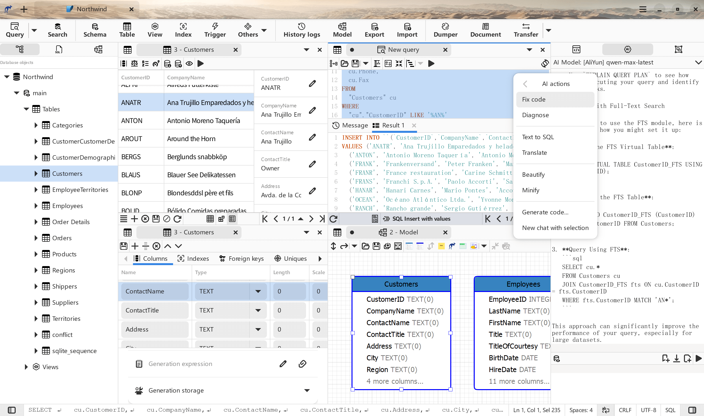

    

# Kangaroo 
Kangaroo is a SQL client and admin tool for popular databases(SQLite / MySQL / PostgreSQL / ...) on Windows / MacOS / Linux, support table design, query, model, sync, export/import etc, focus on comfortable, fun and developer friendly.

__Read this in other languages:__ English | [中文(Chinese)](./README_zh.md)

## Official website / 官方网站
[English](https://www.datatable.online/?from=github) | [中文(Chinese)](https://www.datatable.online/zh/?from=github)

## Support database
Database support capability level: __Planned__ / __Partial__ / __Full(:100:)__

| Database    | Version | Query     | Editing   | Designer  | Export    | Import    | Hint      | Modeling | DB Sync |
|-------------|---------|-----------|-----------|-----------|-----------|-----------|-----------|----------|---------|
| SQLite      | 3.0 +   | Full:100: | Full:100: | Full:100: | Full:100: | Full:100: | Full:100: | in progress | in progress |
| MySQL       | 5.5 +   | Full:100: | Full:100: | Full:100: | Full:100: | Full:100: | Full:100: | in progress | in progress |
| MariaDB     | 10.0 +  | Full:100: | Full:100: | Full:100: | Full:100: | Full:100: | Full:100: | in progress | in progress |
| PostgreSQL  | 9.0 +   | Full:100: | Full:100: | Full:100: | Full:100: | Full:100: | Full:100: | in progress | in progress |
| Redis       |         | Planned   | Planned   | Planned   | Planned   | Planned   | Planned   | Planned  | Planned |
| Oracle      |         |           |           |           |           |           |           |          |         |
| SQL Server  |         |           |           |           |           |           |           |          |         |

**Hint**: Code intellisense or Code autocomplete

## Release
Development version keep one version(vNext) only from year 2023, App version and its packages will be updated regularly(one or two weeks), Beta and Stable version depend on test result and stabilization.

| Architect | Windows         | MacOS           | Linux           | iOS             | Android         | Harmony         |
|----------|-----------------|-----------------|-----------------|-----------------|-----------------|-----------------|
| x86-64 | [v3.91.1](https://www.datatable.online/en/download/v3.92.1.230901?from=github&os=windows) | [v3.91.1](https://www.datatable.online/en/download/v3.92.1.230901?from=github&os=macos) | [v3.91.1](https://www.datatable.online/en/download/v3.92.1.230901?from=github&os=linux) |
| ARM64 | | | | | | |
| RISCV64 | | | | | | |

## Support the Project
If you like Kangaroo and you want to support its development, you could __scan QR code__ to donate via PayPal / Wechat / Alipay. 

## Screenshots

