

    

# Kangaroo 
Kangaroo is a AI-powered SQL client and admin tool for popular databases(SQLite / MariaDB / MySQL / Oracle / PostgreSQL / SQLServer / ...) on Windows / MacOS / Linux, support table design, query, model, sync, export/import etc, focus on comfortable, fun and developer friendly.

__Read this in other languages:__ English | [中文(Chinese)](./README.zh.md)

⚠️ **Note: Kangaroo is a non-open source project, and this repository is only for localization(I18N) and user feedback.**

## Official website / 官方网站
[English](https://www.datatable.online/?from=github) | [中文(Chinese)](https://www.datatable.online/zh/?from=github)

## Support database
Database support capability level: __Planned__ / __Partial__ / __Support__

| Database    | Version | AI        | Query     | Editing   | Designer  | Export    | Import    | Hint      | Modeling     | DB Sync       |
|-------------|---------|-----------|-----------|-----------|-----------|-----------|-----------|-----------|--------------|---------------|
| SQLite      | 3.0 +   | Support   | Support   | Support   | Support   | Support   | Support   | Support   | ✅✅🔲🔲🔲 | ✅✅✅✅🔲 |
| MySQL       | 5.5 +   | Support   | Support   | Support   | Support   | Support   | Support   | Support   | ✅✅🔲🔲🔲 | ✅✅✅✅🔲 |
| MariaDB     | 10.0 +  | Support   | Support   | Support   | Support   | Support   | Support   | Support   | ✅✅🔲🔲🔲 | ✅✅✅✅🔲 |
| PostgreSQL  | 9.0 +   | Support   | Support   | Support   | Support   | Support   | Support   | Support   | ✅✅🔲🔲🔲 | ✅✅✅✅🔲 |
| SQL Server  | 10.0 +  | Support   | Support   | Support   | Support   | Support   | Support   | Support   | ✅✅🔲🔲🔲 | ✅✅✅✅🔲 |
| Redis       | 2.8.0+  | InDev     | Support   | Support   | Support   | Support   | InDev     | InDev     | InDev         | InDev        |
| Oracle      | 11.0 +  | Support   | Support   | Support   | Support   | Support   | Support   | Support   | ✅✅🔲🔲🔲 | ✅✅✅✅🔲 |

**Hint**: Code intellisense or Code autocomplete

## Release
From year 2023, App version and its packages will be updated monthly.

| Architect | Windows         | MacOS           | Linux           | iOS             | Android         | Harmony         |
|----------|-----------------|-----------------|-----------------|-----------------|-----------------|-----------------|
| x86-64 | [v7.99.1.701](https://www.datatable.online/en/download/v7.99.1.701.html?from=github&os=windows) | [v7.99.1.701](https://www.datatable.online/en/download/v7.99.1.701.html?from=github&os=macos) | [v7.99.1.701](https://www.datatable.online/en/download/v7.99.1.701.html?from=github&os=linux) | | Indev | |
| ARM64 | | | | | | |
| RISCV64 | | | | | | |

## Support the Project
If you like Kangaroo and you want to support its development, you could __scan QR code__ to donate via PayPal / Wechat / Alipay. 

## Wechat Subscription Account
Kangaroo will push large articles, videos and tips about Kangaroo via  the Wechat Subscription Account： `袋鼠数据库工具 (DataTableOnline)`, you could subscribe and put your eyes on it if you like it.   

## Screenshots
[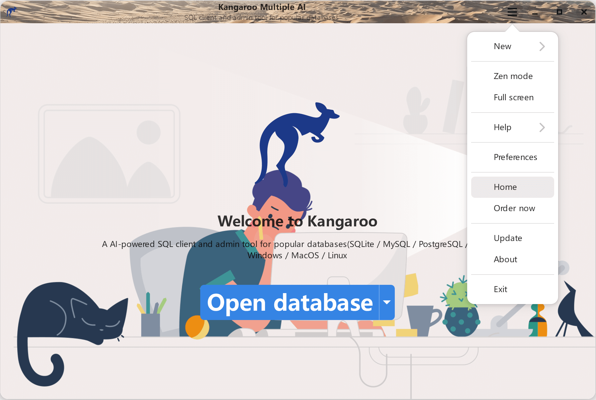](https://www.datatable.online/?from=github "welcome page")
[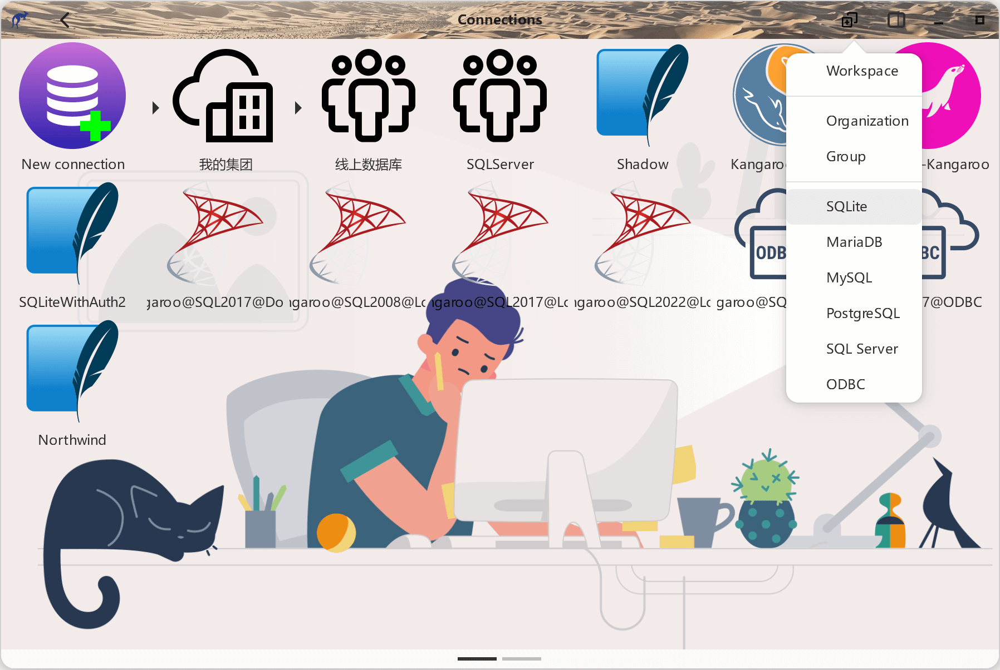](https://www.datatable.online/?from=github "Start page(iconic view)")
[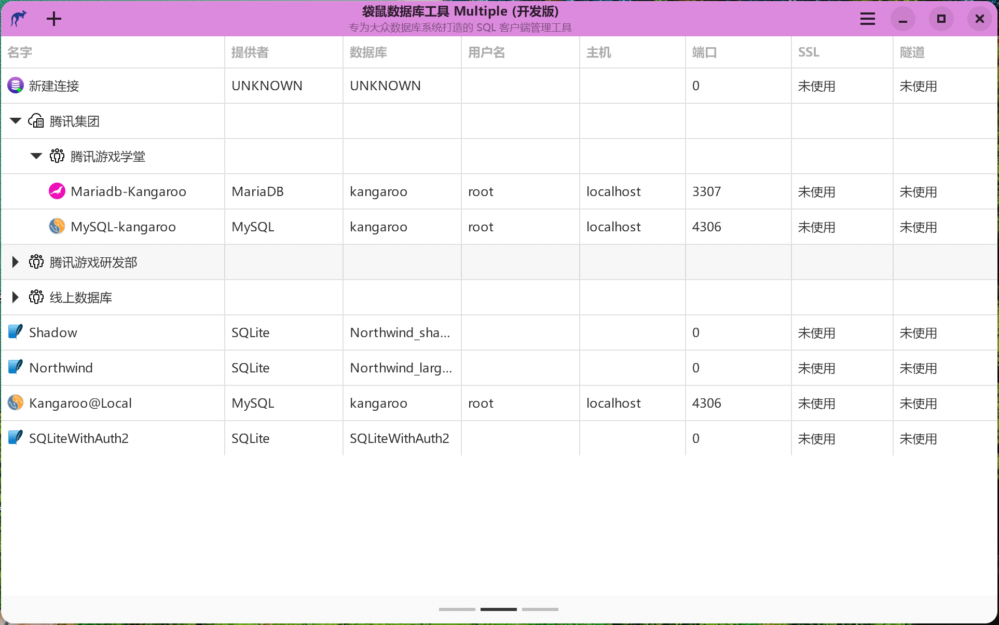](https://www.datatable.online/?from=github "Start page(iconic view)")
[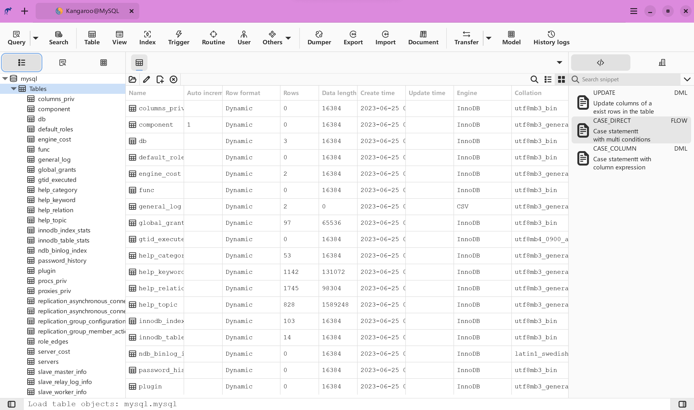](https://www.datatable.online/?from=github "Object explorer")
[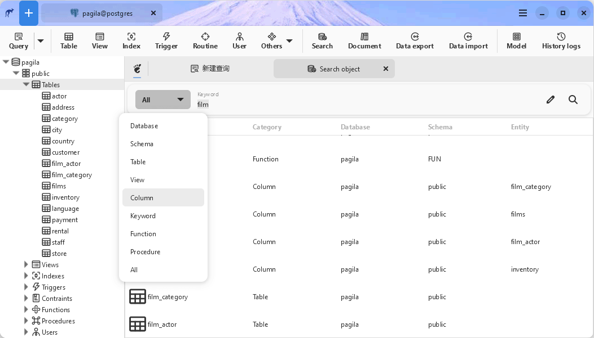](https://www.datatable.online/?from=github "Object search")

[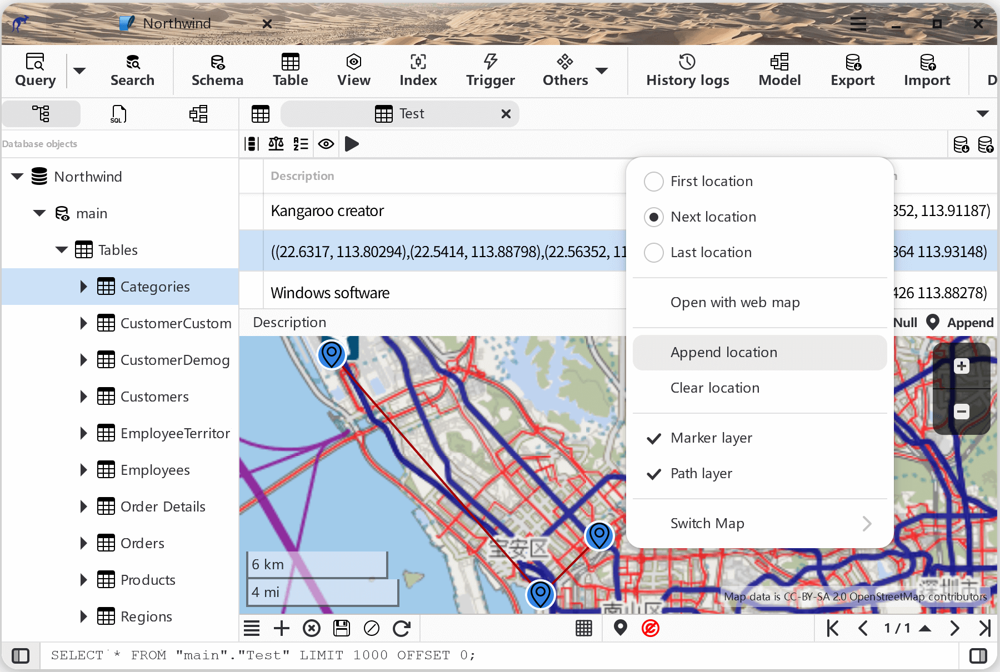](https://www.datatable.online/zh/?from=github "Kangaroo grid view with map support")
[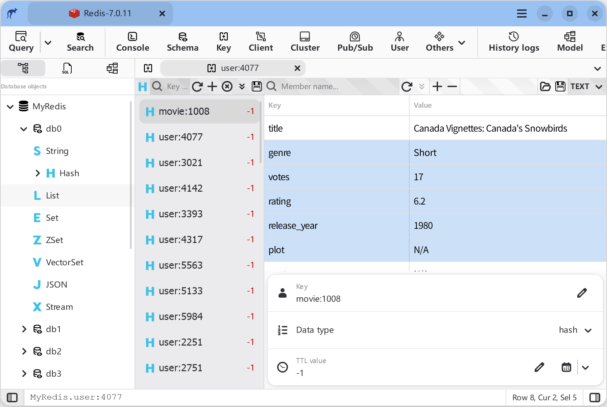](https://www.datatable.online/?from=github "Kangaroo couple view")

[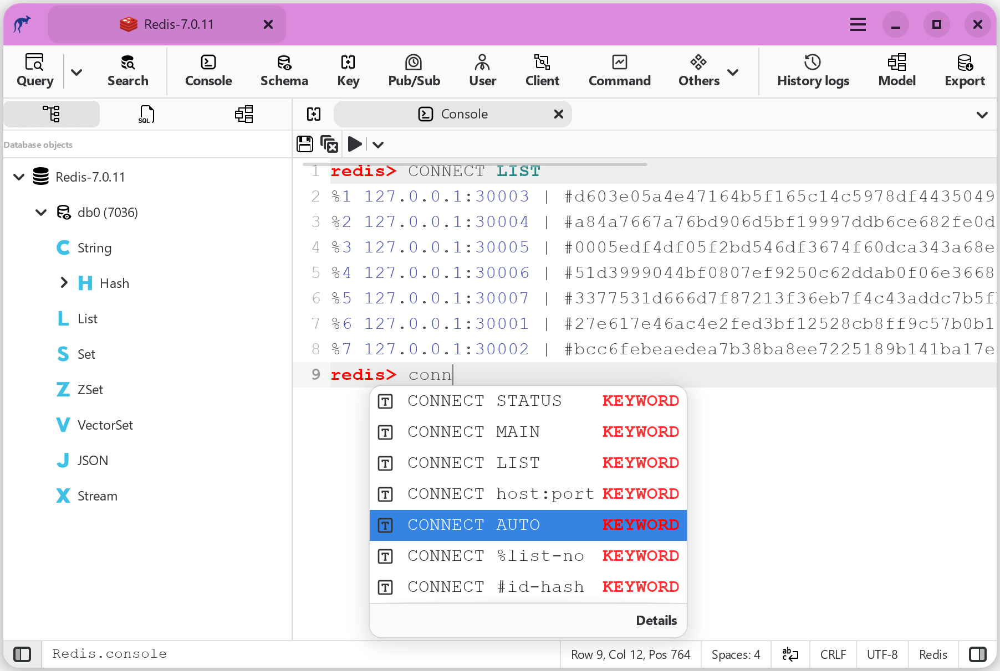](https://www.datatable.online/?from=github "Kangaroo console view")

[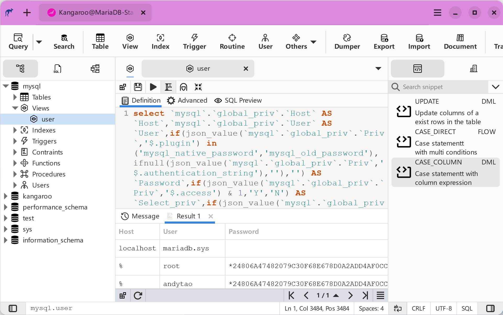](https://www.datatable.online/?from=github "Kangaroo view designer")
[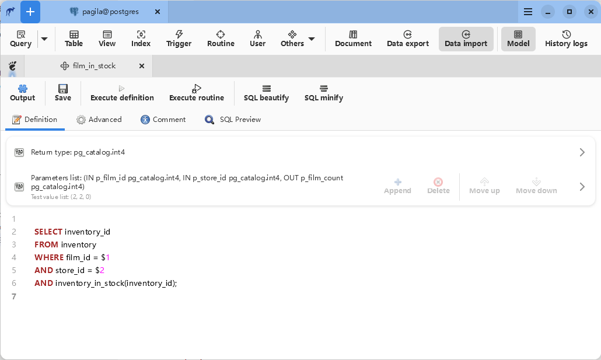](https://www.datatable.online/?from=github "Kangaroo function designer")
[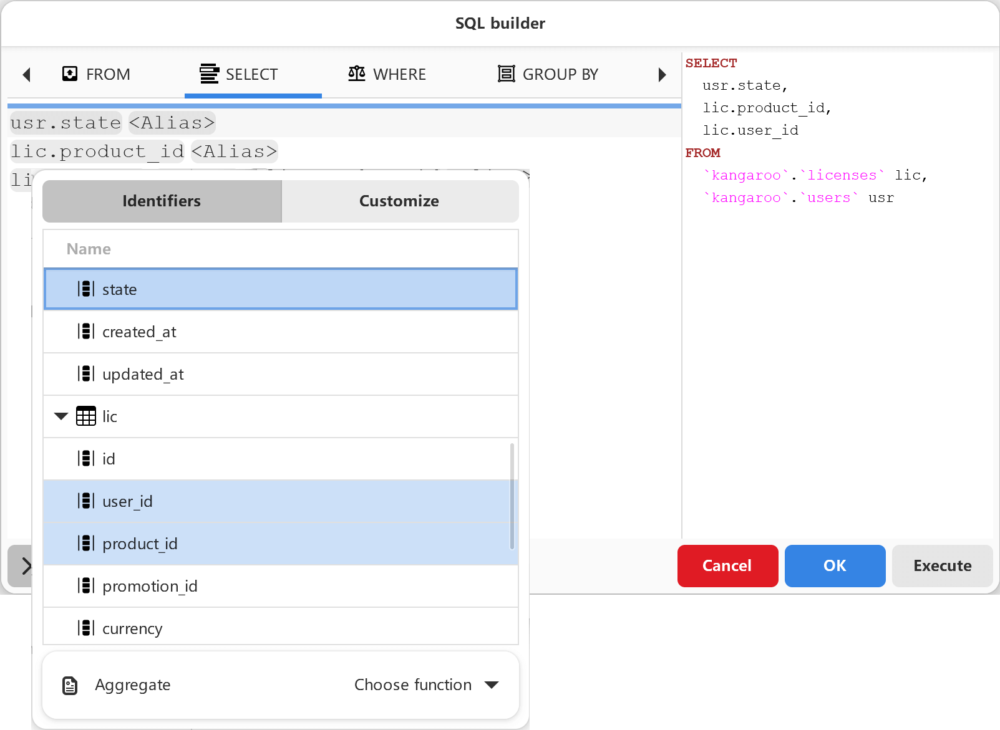](https://www.datatable.online/?from=github "Kangaroo visual builder")

[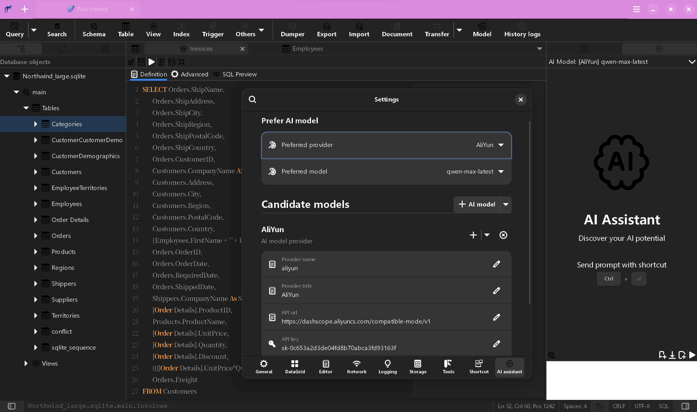](https://www.datatable.online/?from=github "Kangaroo shortcut setting dialog")
