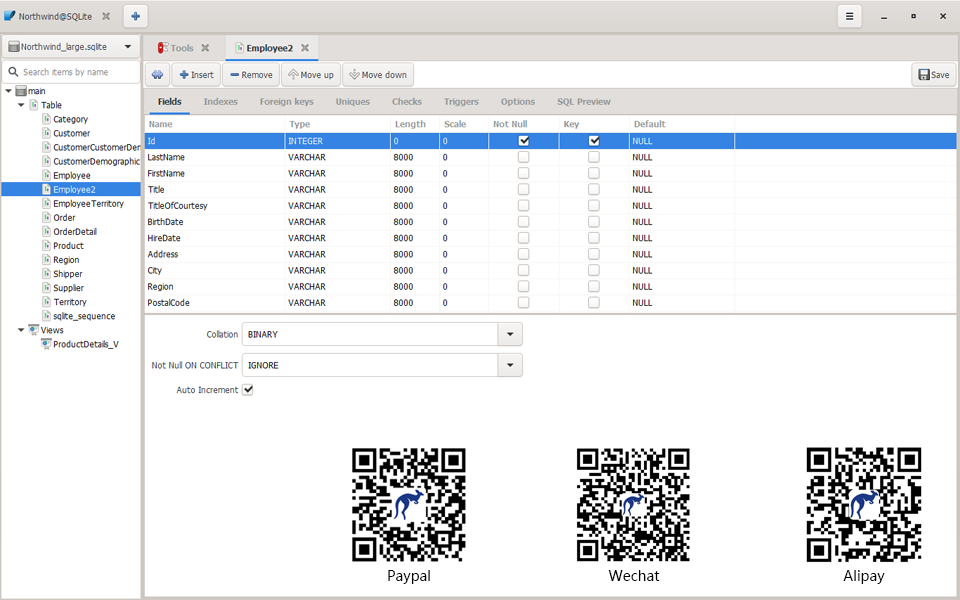

# [Kangaroo](https://dbkangaroo.github.io)
a database management tool for SQLite / MySQL / PostgreSQL on Windows / MacOS / Linux.

# Support database
Database support capability level: __Planned__ / __Partial__ / __Full(:100:)__

| Database       | Version   | Query     | Editing   | Designer    | Intellisense | Modeling | Export Import | DB Sync   | 
|----------------|-----------|-----------|-----------|-------------|--------------|----------|---------------|---------------|
| SQLite         | 3.x       | Full:100: | Full:100: | Partial(50%) | Planned     | Planned  | Partial       | Planned       |
| MySQL          | 8.0       | Full:100: | Full:100: | Partial(50%) | Planned     | Planned  | Partial       | Planned       |
| MariaDB        | 10.x      | Full:100: | Full:100: | Partial(50%) | Planned     | Planned  | Partial       | Planned       |
| PostgreSQL     | 11.x      | Full:100: | Full:100: | Partial(50%) | Planned     | Planned  | Partial       | Planned       |
| Redis          | 5.x       | Planned   | Planned   | Planned      | Planned     | Planned  | Planned       | Planned       |
| Oracle         |           |           |           |             |              |          |               |               |
| SQL Server     |           |           |           |             |              |          |               |               |

# Release
Development version will be released weekly, Stable and LTS(Long-term Support) version depend on test result and stabilization.

| Platform | Linux(64 bit)   | Windows(64 bit) | MacOS(64 bit)   |
|----------|-----------------|-----------------|-----------------|
| Development | [download(v0.8.0.190923)](https://dbkangaroo.github.io/download/v0.8.0.190923) | [download(v0.8.0.190923)](https://dbkangaroo.github.io/download/v0.8.0.190923) | Comming Soon! |
| Stable   | On going......  | On going......  | On going......  |

# Install
## Step one
__Linux__

__Ubuntu__: Install dependency package via APT: GTK3/Gee/GtkSourceView4/libsoup/libgda/json-glib

__Windows__
1. Install dependency package via MSYS2: GTK3/Gee/GtkSourceView4/libsoup/libgda/json-glib
2. Download windows installer and execute it, following the guide to install Kangaroo.

## Step two
download latest version of Kangaroo to bin path, then run it. 
__Note__: only for installing Kangaroo vis MSYS2

# Support the Project
If you like Kangaroo and you want to support its development, pls scan QR code to donate via PayPal / Wechat / Alipay.

# Screenshots

