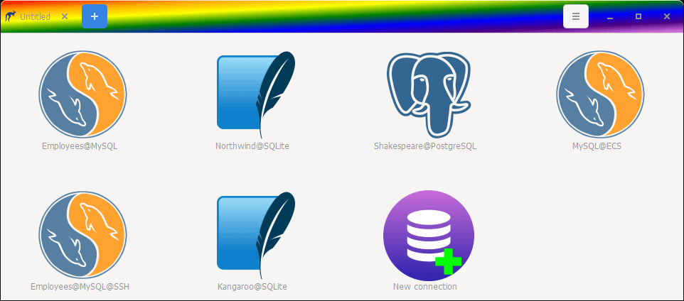
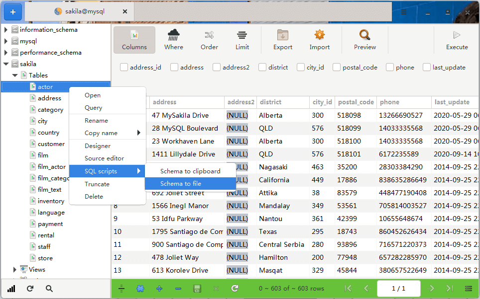
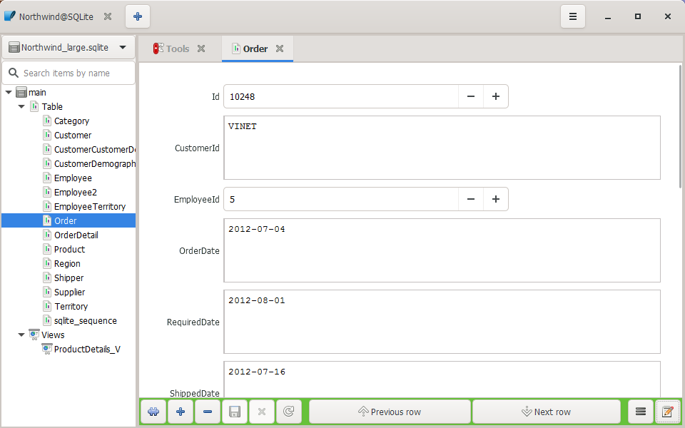
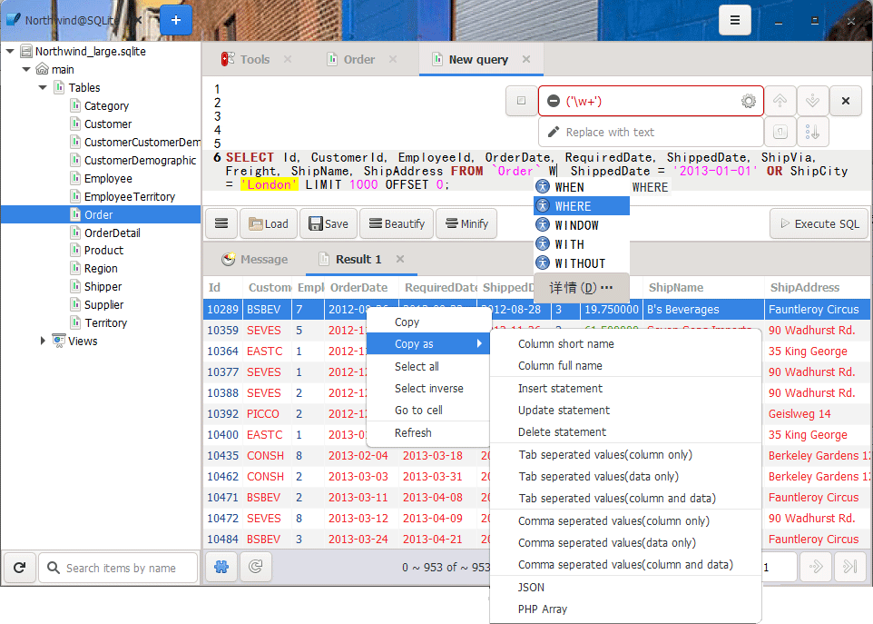
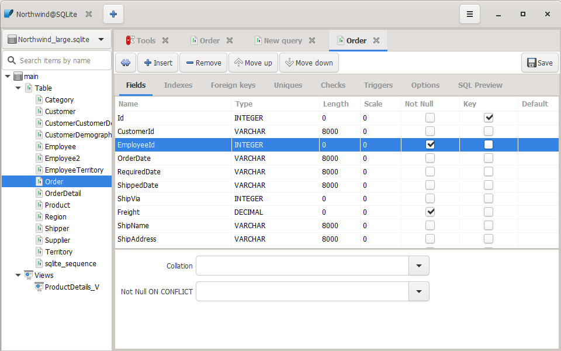
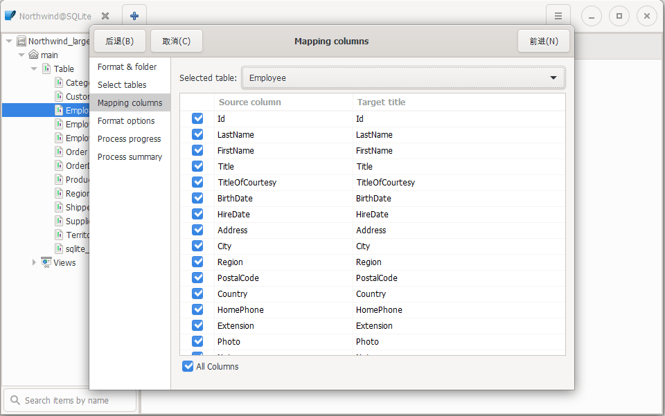
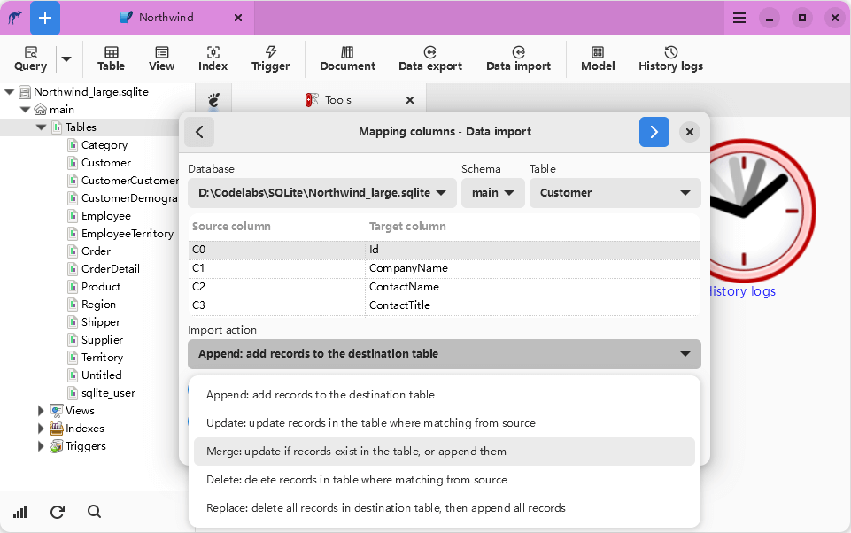
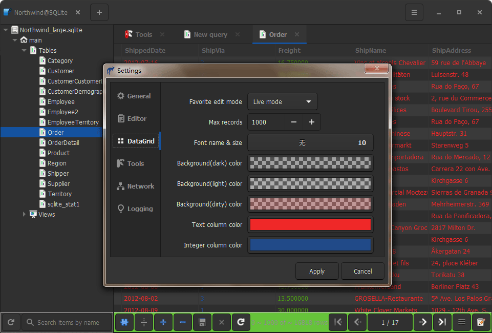

# Kangaroo [Official website](https://dbkangaroo.github.io)  [中文官网](https://dbkangaroo.github.io/zh/)
SQL client and admin tool for popular databases(SQLite / MySQL / PostgreSQL / ...) on Windows / MacOS / Linux.

# Support database
Database support capability level: __Planned__ / __Partial__ / __Full(:100:)__

| Database    | Version | Query     | Editing   | Designer  | Export    | Import    | Hint      | Modeling | DB Sync |
|-------------|---------|-----------|-----------|-----------|-----------|-----------|-----------|----------|---------|
| SQLite      | 3.0 +   | Full:100: | Full:100: | Full:100: | Full:100: | Full:100: | Full:100: | Planned  | Planned |
| MySQL       | 5.5 +   | Full:100: | Full:100: | Full:100: | Full:100: | Full:100: | Full:100: | Planned  | Planned |
| MariaDB     | 10.0 +  | Full:100: | Full:100: | Full:100: | Full:100: | Full:100: | Full:100: | Planned  | Planned |
| PostgreSQL  | 9.0 +   | Full:100: | Full:100: | Full:100: | Full:100: | Full:100: | Full:100: | Planned  | Planned |
| Redis       |         | Planned   | Planned   | Planned   | Planned   | Planned   | Planned   | Planned  | Planned |
| Oracle      |         |           |           |           |           |           |           |          |         |
| SQL Server  |         |           |           |           |           |           |           |          |         |

**Hint**: Code intellisense or Code autocomplete

# Release
Development version will be released weekly, Stable and LTS(Long-term Support) version depend on test result and stabilization.

| Platform | Windows(64 bit) | Linux(64 bit)   | MacOS(64 bit)   |
|----------|-----------------|-----------------|-----------------|
| Stable | [Kangaroo 2020(Beta 3)](https://dbkangaroo.github.io/download/v0.99.3.200921) | [Kangaroo 2020(Beta 3)](https://dbkangaroo.github.io/download/v0.99.3.200921) | [Kangaroo 2020(Beta 3)](https://dbkangaroo.github.io/download/v0.99.3.200921) |
| Development | [v0.33.1.200817](https://dbkangaroo.github.io/download/v0.33.1.200817) | [v0.33.1.200817](https://dbkangaroo.github.io/download/v0.33.1.200817) | [v0.33.1.200817](https://dbkangaroo.github.io/download/v0.33.1.200817) |

# Support the Project
If you like Kangaroo and you want to support its development, you could __buy me a coffee__ or __scan QR code__ to donate via PayPal / Wechat / Alipay.

 

# Screenshots

