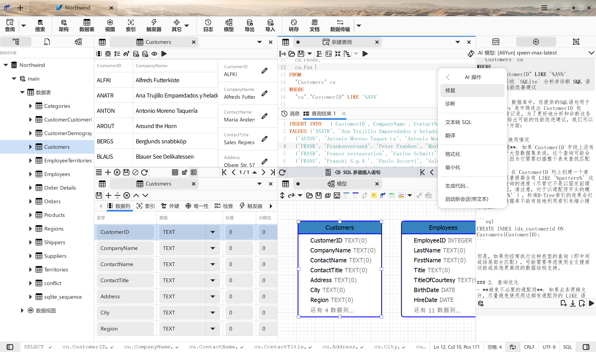

    

# 袋鼠数据库工具 / Kangaroo
袋鼠 是一款 AI 驱动的热门数据库系统客户端(SQLite / MySQL / PostgreSQL / SQLServer / ...) ，支持建表、查询、模型、同步、导入导出等功能，支持 Windows / Mac / Linux 等操作系统，力求打造成好用、好玩、开发友好的SQL工具。

__其他语言版本:__ 中文 | [英文(English)](./README.en.md)

⚠️ **注意: Kangaroo 是非开源项目, 本仓库仅用来管理本地化(I18N)和用户反馈。**

## 官方网站 / Official website
[中文](https://www.datatable.online/zh/?from=github) | [英文(English)](https://www.datatable.online/zh/?from=github)

## 支持的数据库系统
数据库支持能力级别: __已计划__ / __部分__ / __支持__

| 数据库      | 支持版本 |  AI 支持   |SQL 查询  | 数据编辑  | 表设计器 | 导出     | 导入     | 智能提示  | 模型化        | 数据同步      |
|------------|----------|-----------|----------|----------|---------|----------|----------|----------|---------------|--------------|
| SQLite     | 3.0 +    | 支持      | 支持      | 支持     | 支持     | 支持     | 支持     | 支持     | ✅✅🔲🔲🔲  | ✅✅✅✅🔲 |
| MySQL      | 5.5 +    | 支持      | 支持      | 支持     | 支持     | 支持     | 支持     | 支持     | ✅✅🔲🔲🔲  | ✅✅✅✅🔲 |
| MariaDB    | 10.0 +   | 支持      | 支持      | 支持     | 支持     | 支持     | 支持     | 支持     | ✅✅🔲🔲🔲  | ✅✅✅✅🔲 |
| PostgreSQL | 9.0 +    | 支持      | 支持      | 支持     | 支持     | 支持     | 支持     | 支持     | ✅✅🔲🔲🔲  | ✅✅✅✅🔲 |
| SQL Server | 10.0 +   | 支持      | 支持      | 支持     | 支持     | 支持     | 支持     | 支持     | ✅✅🔲🔲🔲  | ✅✅✅✅🔲 |
| Redis      |          | 已计划    | 已计划    | 已计划    | 已计划   | 已计划   | 已计划   | 已计划    | 已计划         | 已计划        |
| Oracle     |          | 开发中    | 开发中    | 开发中    | 开发中   | 开发中   | 开发中   | 开发中    | 开发中         | 开发中        |

## 版本发布
从 2023年开始，App 版本和发布包定期更新，计划一个月发布一个版本。

| CPU 架构  | Windows         | MacOS           | Linux           | iOS             | Android         | Harmony         |
|-----------|-----------------|-----------------|-----------------|-----------------|-----------------|-----------------|
| x86-64 | [v6.3.1.0105](https://www.datatable.online/zh/download/v6.3.1.0105.html?from=github&os=windows) | [v6.3.1.0105](https://www.datatable.online/zh/download/v6.3.1.0105.html?from=github&os=macos) | [v6.3.1.0105](https://www.datatable.online/zh/download/v6.3.1.0105.html?from=github&os=linux) |
| ARM64 | | | | | | |
| RISCV64 | | | | | | |

## 支持和赞助项目
如果您觉得袋鼠数据库工具有用且愿意支持它持续丰富功能，您可以通过如下方式支持和赞助项目，扫码即可通过 PayPal / 微信支持 / 支付宝完成付款。 

## 微信公众号
为即时推送关于袋鼠的大篇幅文章和视频，故开通了微信公众号： 袋鼠数据库工具 (DataTableOnline)，有兴趣的同学可关注。  

## 工具界面快照

