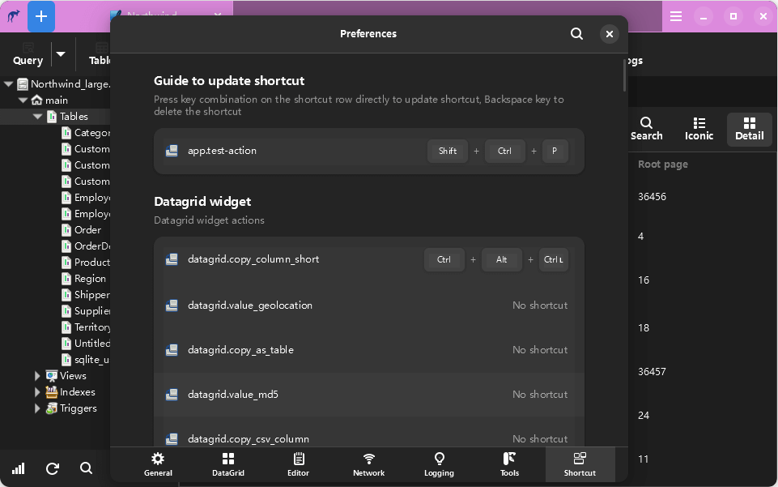

# 袋鼠数据库工具 / Kangaroo
袋鼠 是一款为热门数据库系统打造的管理客户端(SQLite / MySQL / PostgreSQL / ...) ，支持建表、查询、模型、同步、导入导出等功能，支持 Windows / Mac / Linux 等操作系统，力求打造成好用、好玩、开发友好的SQL工具。

__其他语言版本:__ 中文 | [英文(English)](./README.md)

## 官方网站 / Official website
[中文](https://www.datatable.online/zh/?from=github) | [英文(English)](https://www.datatable.online/?from=github)

## 支持的数据库系统
数据库支持能力级别: __已计划__ / __部分__ / __支持(:100:)__

| 数据库       | 支持版本 | SQL 查询     | 数据编辑   | 表设计器  | 导出    | 导入    | 智能提示      | 模型化 | 数据同步 |
|-------------|---------|--------------|------------|----------|---------|--------|---------------|-------|---------|
| SQLite      | 3.0 +   | 支持:100: | 支持:100: | 支持:100: | 支持:100: | 支持:100: | 支持:100: | **进行中**  | 已计划 |
| MySQL       | 5.5 +   | 支持:100: | 支持:100: | 支持:100: | 支持:100: | 支持:100: | 支持:100: | **进行中**  | 已计划 |
| MariaDB     | 10.0 +  | 支持:100: | 支持:100: | 支持:100: | 支持:100: | 支持:100: | 支持:100: | **进行中**  | 已计划 |
| PostgreSQL  | 9.0 +   | 支持:100: | 支持:100: | 支持:100: | 支持:100: | 支持:100: | 支持:100: | **进行中**  | 已计划 |
| Redis       |         | 已计划   | 已计划   | 已计划   | 已计划   | 已计划   | 已计划   | 已计划  | 已计划 |
| Oracle      |         |           |           |           |           |           |           |          |         |
| SQL Server  |         |           |           |           |           |           |           |          |         |

## 版本发布
开发版本按周发布，计划一周或两周发布一个, 稳定版本和长周期支持版本(LTS) 根据版本质量评估情况不定期发布。

| 版本类型    | Windows(64 bit)   | MacOS(64 bit)   | Linux(64 bit)   |
|-------------|-------------------|-------------------|-----------------|
| 稳定版本 | [Kangaroo v1.0.6.201109](https://www.datatable.online/zh/download/v1.0.6.201109?from=github&os=windows) | [Kangaroo v1.0.6.201109](https://www.datatable.online/zh/download/v1.0.6.201109?from=github&os=macos) | [Kangaroo v1.0.6.201109](https://www.datatable.online/zh/download/v1.0.6.201109?from=github&os=linux) |
| 开发版本 | [Kangaroo v1.8.1.210430](https://www.datatable.online/zh/download/v1.8.1.210430?from=github&os=windows) | [Kangaroo v1.8.1.210430](https://www.datatable.online/zh/download/v1.8.1.210430?from=github&os=macos) | [Kangaroo v1.8.1.210430](https://www.datatable.online/zh/download/v1.8.1.210430?from=github&os=linux) |

## 支持和赞助项目
如果您觉得袋鼠数据库工具有用且愿意支持它持续丰富功能，您可以通过如下方式支持和赞助项目（点击链接或扫码即可通过 PayPal / 微信支持 / 支付宝付款）. 
  

## 更多技术支持

<table width="100%" border="0" cellspacing="0" cellpadding="0">
  <tr>
    <td align="center"></td>
    <td align="center"></td>
    <td align="center" style="width:200px;">&nbsp;&nbsp;&nbsp;&nbsp;</td>
  </tr>
  <tr>
    <td align="center">微信公众号</td>
    <td align="center">QQ 交流群</td>
    <td align="center">微信交流群</td>
  </tr>
</table>

## 工具界面快照

