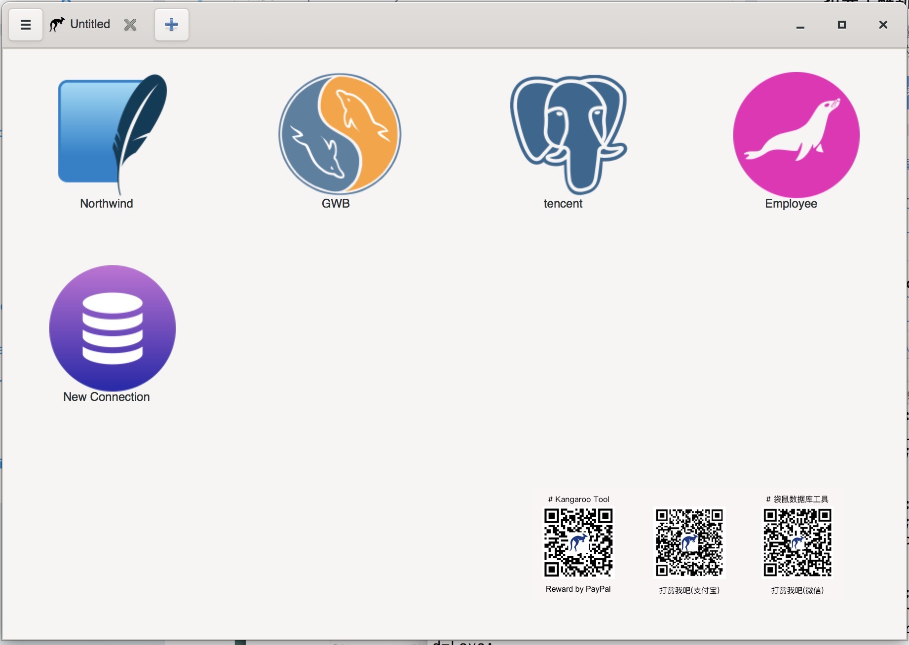
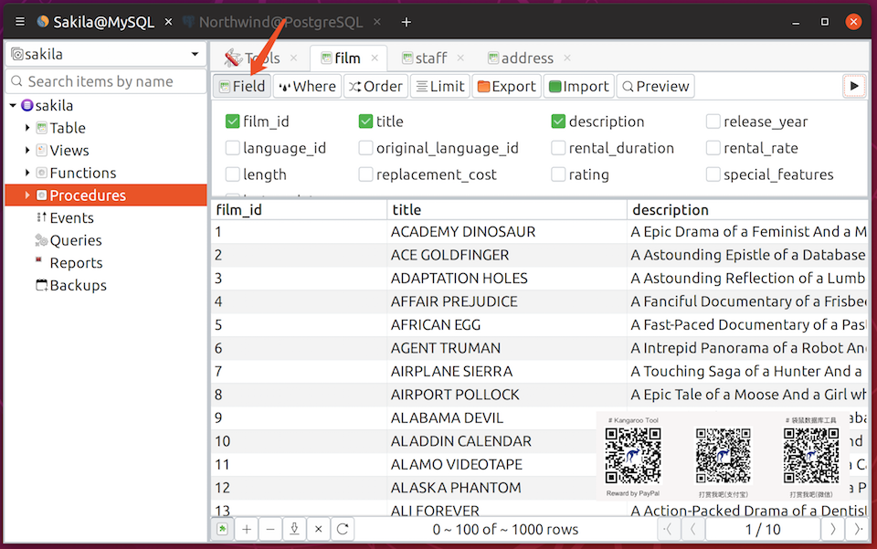
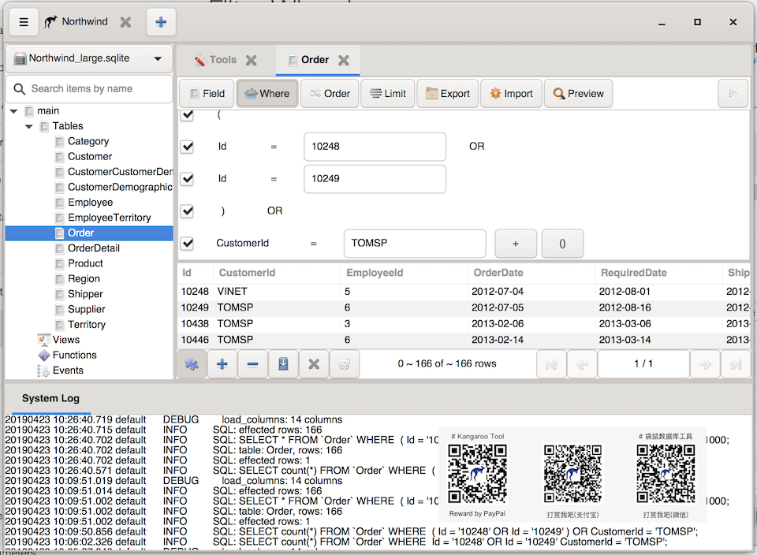
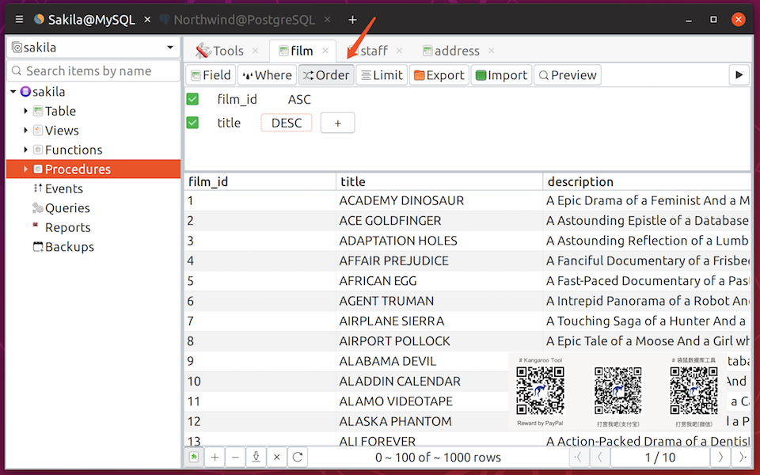
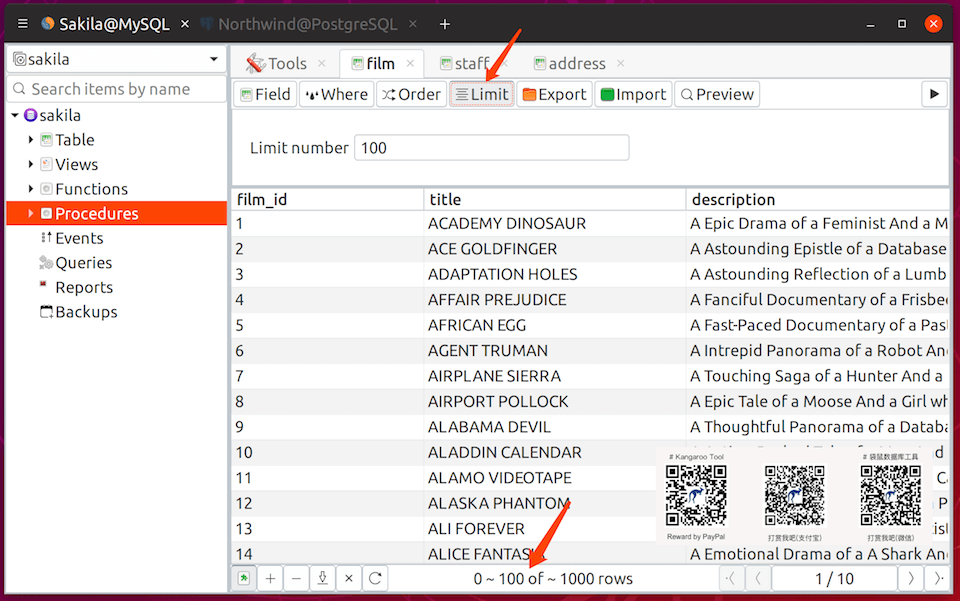
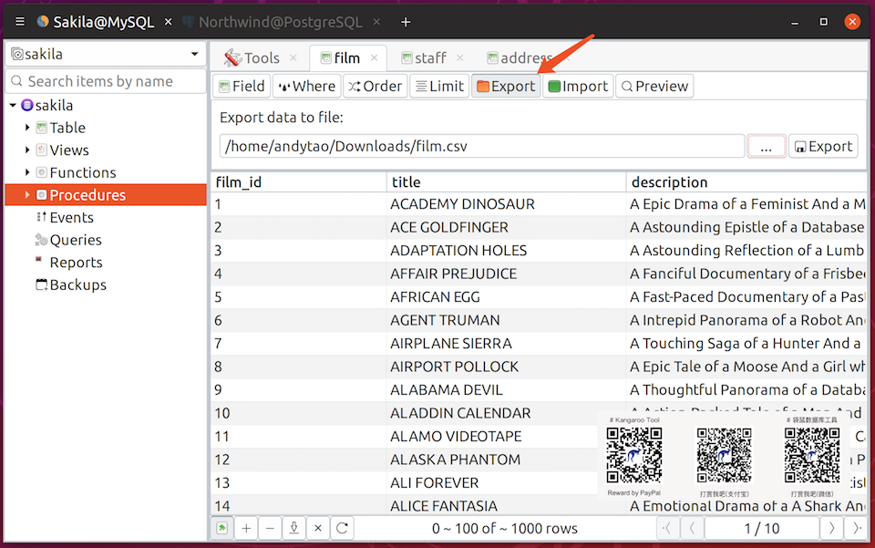
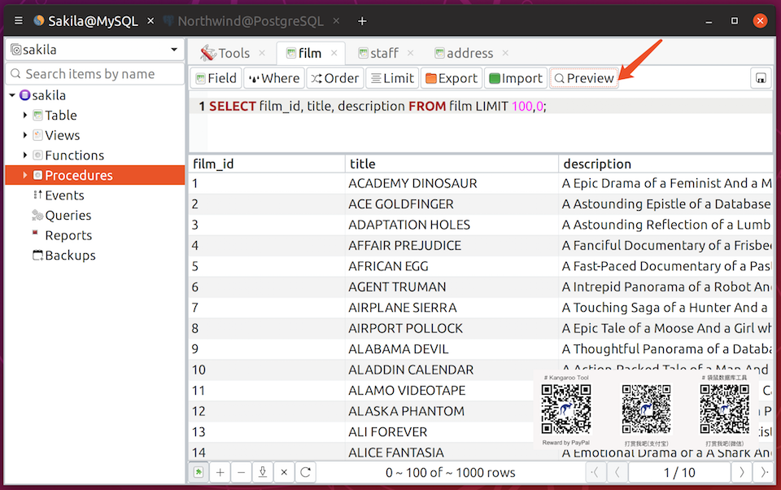

# Install
package will be published on ealy of july or end of this month, depend on test result.

| Platform            | Linux 	                      | Windows       	      | MacOS 	              |
|---------------------|-------------------------------|-----------------------|-----------------------|
| Support databases   | SQLite/MySQL/PostgreSQL       | SQLite/TBD 	          | SQLite/TBD            |
| Release date        | Comming Soon!          	      | Comming Soon! 	      | Comming Soon!         |

# Screenshots

<!--Adsense data-ad-client="ca-pub-3975819313740938" data-ad-slot="6760827895"/-->

